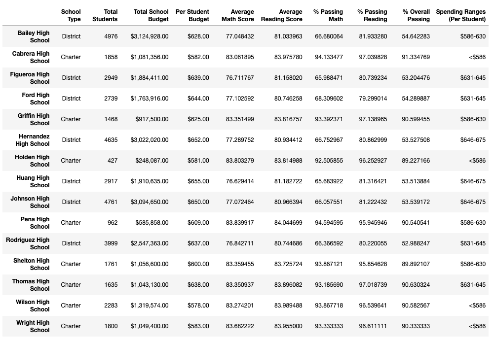

# School_District_Analysis
Module 4

## Overview of the school district analysis: 

  The school board has notified Maria, our client, and her supervisor that our original analysis dataset shows evidence of questionable reading and math grades for Thomas High School ninth graders. Although the school board assume some level of academic dishonesty, they have requested of Mari that their is further analysis excluding these extraneous scores. Maria has requested we replace the math and reading scores for Thomas High School with NaNs (missing values) while keeping the rest of the data intact. Subsequently, Maria would like you to repeat the original school district analysis and to describe how these excluding scores of Thomas High School ninth graders affected the overall analysis.

## Results: Using bulleted lists and images of DataFrames as support, address the following questions.

  1. How is the district summary affected?
  
  From the analysis, there were no significant changes. While the tables presented are in response to prompts, analysis of the scores indicate only slight variations in percent passing in math, reading, and overall. More specifically, the scores actually decreased with the exclusion of Thomas High School ninth graders. 
  
  #### Original District Summary 
  
  
  #### TH_9th-Excluded District Summary
  
  
  2. How is the school summary affected?

  #### Original District Summary 
  
  
  #### TH_9th-Excluded District Summary
 
  
  3. How does replacing the ninth graders’ math and reading scores affect Thomas High School’s performance relative to the other schools?

  As can be seen above, replacing the score of ninth grade Thomas High Schools students did not ultimately serve the analyses and may speak to inflated scores but with information into the rigor of curriculum or the student's academic reputation, it is dicidult to make assumptions
  
  
  ### How does replacing the ninth-grade scores affect the following:
  
  Overall, the exclusion of ninth grade Thomas High School students did not significantly impact the overall math and reading by grade, math and reading by spending, math and reading by size, or math and reading by school type. 
  
  5. Math and reading scores by grade
  
  
  
  
  
  
  
  
  
  6. Scores by school spending
  
  
  
  
  
  7. Scores by school size
  8. 
  
  
  
  
  
  8. Scores by school type
  
    
  

## Summary:  Four changes in the updated school district analysis as a result of reading and math scores for the ninth grade at Thomas High School have been replaced with NaNs.
  1. While there were questions regarding the Thomas High ninth grade scores, the analysis is inequitable since other schools were essentially penalized for including their ninth grade score for reading, but especially math. Overall, ninthe grade student scored lower than upper class students, which can be seen in the jump in Thomas High's overall score. 
  
  2. The limitation in the analysis is understanding the question about the Thomas High scores. It may be beneficial to scrutinize the variance in scores within schools and across schools within grade levels. It may show that excluding Thomas High ninth grade scores was unwarrented. 
  
  3. For the district analysis, there was not much difference in the overall results. Again, it may not have been useful to exclude THS ninth graders, but possibly more useful to replace there score with the mean of other 9th grade students in math and reading. 
  
  4. Overall, there was not much variance in scores for the data analysis trials, but this may also be a consequence of using jupyter to run code in one notebook. 
